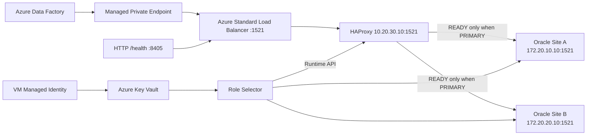

# Oracle Role-Aware Failover Proxy

A sanitized implementation pattern for routing Azure Data Factory traffic only to the writable Oracle Data Guard PRIMARY.

> All names, IP addresses, resource identifiers and credentials in this directory are synthetic. The examples are designed to demonstrate the engineering pattern without exposing employer or customer information.

## Problem

A private Azure Data Factory workload can successfully connect to both Oracle Data Guard sites because both listeners remain reachable and expose the same service name. A simple TCP health check therefore cannot distinguish the writable PRIMARY from a read-only physical standby.

The failure mode looks deceptively healthy at the network layer:

```text
DNS        ✓
Routing    ✓
TCP 1521   ✓
TLS/auth   ✓
Oracle     ✓
Write      ✗  ORA-16000 read-only database
```

The goal is to make routing depend on Oracle role rather than static IP selection.

## Architecture



## Files

```text
case-studies/oracle-role-aware-failover/
├── README.md
├── haproxy.cfg
├── check-oracle-roles.sh
├── select-primary.sh
└── systemd/
    ├── oracle-haproxy.service
    ├── oracle-primary-selector.service
    └── oracle-primary-selector.timer
```

## Synthetic environment

| Purpose | Example value |
|---|---|
| Proxy VM | `proxy-oracle-01` |
| Proxy private IP | `10.20.30.10` |
| Oracle Site A | `172.20.10.10` |
| Oracle Site B | `172.20.20.10` |
| Oracle service | `APPDB` |
| Oracle user | `APP_RW_USER` |
| Key Vault | `https://kv-shared-prod.vault.azure.net` |
| Secret | `APP_RW_PASSWORD` |
| HAProxy data port | `1521` |
| HAProxy health port | `8405` |

## Role query

The checker deliberately uses Oracle itself as the source of truth:

```sql
SELECT
    SYS_CONTEXT('USERENV','DATABASE_ROLE')  AS DATABASE_ROLE,
    SYS_CONTEXT('USERENV','DB_UNIQUE_NAME') AS DB_UNIQUE_NAME,
    SYS_CONTEXT('USERENV','SERVER_HOST')    AS SERVER_HOST,
    SYS_CONTEXT('USERENV','SERVICE_NAME')   AS SERVICE_NAME
FROM dual;
```

## Fail-closed policy

The HAProxy servers start disabled. The selector enables a backend only when it can prove that one site is PRIMARY and the other is a recognized standby role.

```text
PRIMARY + STANDBY → enable PRIMARY
STANDBY + PRIMARY → enable PRIMARY
anything else     → disable both
```

This avoids routing writes when one role is unknown, both appear primary, neither appears primary, Key Vault is unavailable, or the role query fails.

## Managed identity and Key Vault

The role checker retrieves the Oracle password at runtime using the VM's managed identity. No database password is stored in the repository or passed on the command line.

The example scripts use Azure Instance Metadata Service to request a Key Vault token, then read the configured secret over the Key Vault REST API.

## systemd automation

`oracle-haproxy.service` manages HAProxy. `oracle-primary-selector.service` performs one role evaluation. `oracle-primary-selector.timer` repeats the evaluation.

A typical startup sequence is:

```text
systemd starts HAProxy
        ↓
all Oracle backends are disabled
        ↓
selector timer runs
        ↓
Key Vault secret retrieved using managed identity
        ↓
both Oracle roles queried
        ↓
PRIMARY enabled / STANDBY kept in maintenance
```

## Load Balancer health

The HAProxy config exposes `/health` on port `8405`.

```text
HTTP 200 → a verified Oracle backend is eligible
HTTP 503 → no verified Oracle backend is eligible
```

The Azure Load Balancer should probe this endpoint rather than SSH or raw TCP 1521.

Example Azure CLI shape:

```bash
az network lb probe create \
  --resource-group rg-data-platform-prod \
  --lb-name lb-oracle-proxy-prod \
  --name oracle-primary-health \
  --protocol Http \
  --port 8405 \
  --path /health \
  --interval 15

az network lb rule update \
  --resource-group rg-data-platform-prod \
  --lb-name lb-oracle-proxy-prod \
  --name oracle-1521 \
  --probe-name oracle-primary-health
```

## Safe migration pattern

A low-risk migration from static DNAT to HAProxy can be staged:

1. Run HAProxy on a loopback test port.
2. Prove SQL sessions land on PRIMARY.
3. Put HAProxy and the selector under systemd.
4. Intentionally force the wrong backend state and prove automatic correction.
5. Bind HAProxy to the real proxy IP and port while the legacy DNAT rule still intercepts inbound traffic.
6. Test the real listener locally.
7. Remove only the live DNAT rule.
8. Validate the application path.
9. Remove the persisted DNAT rule.
10. Replace the Load Balancer's infrastructure-only health probe with `/health`.

## Important limitation

This pattern solves role-aware Oracle routing, not proxy-node high availability. A production design should normally place two independently configured proxy VMs behind the Load Balancer so the proxy layer itself is not a single point of failure.
